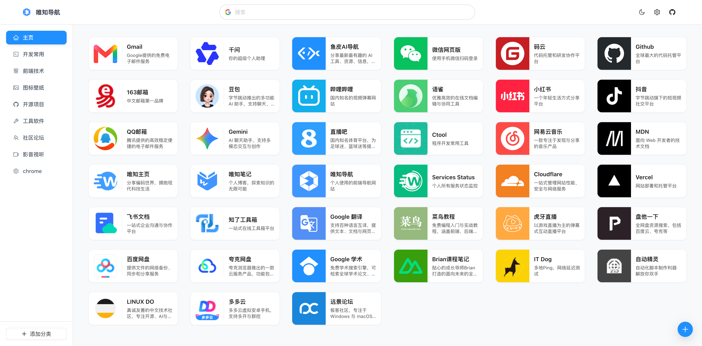

# 前端导航网站 🚀

<div align="center">



现代化的个人前端导航网站，为开发者提供高效、美观的资源导航体验

前期使用 Kiro 的 Spec 模式开发（模型 Claude Sonnet）；后期使用 Antigravity 进行迭代和 bug 修复（模型 Gemini）

[](https://nextjs.org/)
[](https://www.typescriptlang.org/)
[](https://tailwindcss.com/)
[](https://ant.design/)
[](./LICENSE)

<a href="https://nav.weizwz.com" target="_blank">在线演示</a> | [快速开始](#-快速开始) | [文档](./.agent/specs/frontend-navigation-site/)

</div>

---

## ✨ 核心特性

| 特性                                                                                                                                                             | 描述                                   | 备注                         |
| :--------------------------------------------------------------------------------------------------------------------------------------------------------------- | :------------------------------------- | :--------------------------- |
|  **响应设计**        | 完美适配桌面、平板、手机               | 多端适配                     |
|  **实时搜索**         | 支持多维度匹配                         | 默认站内，回车可搜索站外网页 |
|  **灵活管理**           | 支持添加、编辑、删除， 拖拽排序        |                              |
|  **持久数据**           | 支持数据的导入导出                     |                              |
|  **主题切换**      | 支持明暗主题切换，平滑过渡             |                              |
|  **PWA支持** | 支持安装到桌面，离线可用               |                              |
|  **性能优化**          | KeepAlive 视图缓存、Cache API 图标存储 | Lighthouse 90+               |
|  **可访问性**  | 遵循无障碍设计标准                     | WCAG 2.1 AA                  |
|  **Chrome扩展**    | 独立扩展程序，支持多标签页状态实时同步 |                              |

---

## 🛠️ 技术栈

Next.js 16 · TypeScript 5 · Tailwind CSS 4 · Ant Design 6 · Redux Toolkit · Framer Motion

---

## 主要目录

```text
weiz-nav/
├── apps/
│   ├── web/               # 核心 Web 端应用 (Next.js 16 App Router)
│   └── extension/         # Chrome 浏览器扩展端 (React + Vite SPA)
├── packages/
│   ├── core/              # 核心领域逻辑、全局类型定义、数据默认配置 (如 data.json)
│   ├── services/          # 基础服务层 (数据持久化 Storage、外部 API 封装如 Favicon API)
│   ├── store/             # 全局状态管理层 (Redux Toolkit，包含 links, categories, settings 等切片)
│   └── ui/                # 跨端共享视图层 (包含所有通用 UI 组件，如 LinkCard, ManageView, Header)
└── scripts/               # 工程化脚手架与自动化脚本 (如 sync-version.js 同步各个包版本)
```

## 🚀 快速开始

```bash
# 克隆项目
git clone <repository-url>
cd weiz-nav

# 安装依赖
pnpm install

# 配置环境变量（可选）
cp .env.example .env.local
# 编辑 .env.local 设置你的网站 URL

# 启动开发服务器
pnpm dev
```

---

## 🚢 部署

项目使用 **[OpenNext](https://opennext.js.org/cloudflare) + Cloudflare Workers** 方案部署，支持完整的 SSR 能力。

### 前置条件

- 已安装 [Wrangler CLI](https://developers.cloudflare.com/workers/wrangler/)（项目 devDependency 已包含）
- 已登录 Cloudflare 账号：`pnpm wrangler login`

### 常用命令

| 命令                     | 说明                            |
| :----------------------- | :------------------------------ |
| `pnpm build`             | 仅构建 Next.js（不部署）        |
| `pnpm preview`           | 构建并在本地 Workers 运行时预览 |
| `pnpm deploy`            | 构建并部署到 Cloudflare Workers |
| `pnpm upload:cloudflare` | 构建并上传新版本（不立即生效）  |

### 手动部署

```bash
# 登录 Cloudflare（首次需要）
pnpm wrangler login

# 构建并部署
pnpm deploy
```

### 本地预览（Workers 运行时）

```bash
# 在与生产环境相同的 Workers 运行时中本地预览
pnpm preview
```

### 环境变量

Cloudflare Workers 部署时，环境变量通过 `.env.local` 或 `.env.production` 文件注入（需提交到代码库，或在 Cloudflare Dashboard 的 Workers 设置中配置）。

```bash
# 复制示例文件
cp .env.example .env.local
```

| 变量                          | 说明                      | 默认值                       |
| :---------------------------- | :------------------------ | :--------------------------- |
| `NEXT_PUBLIC_SITE_URL`        | 网站 URL，用于 Open Graph | `https://nav.weizwz.com`     |
| `NEXT_PUBLIC_API_ICONIFY_URL` | Iconify API 地址          | `https://api.iconify.design` |
| `NEXT_PUBLIC_FAVICON_API_URL` | Favicon 获取服务地址      | `https://favicon.im`         |

### GitHub Actions 自动部署

推送到 `master` 分支时自动触发部署，需要在仓库 **Settings → Secrets and variables → Actions** 中配置：

| Secret                  | 说明                                          |
| :---------------------- | :-------------------------------------------- |
| `CLOUDFLARE_API_TOKEN`  | Cloudflare API Token（需要 Workers 编辑权限） |
| `CLOUDFLARE_ACCOUNT_ID` | Cloudflare Account ID                         |

**获取 API Token：**

1. 登录 [Cloudflare Dashboard](https://dash.cloudflare.com) → **My Profile** → **API Tokens**
2. 点击 **Create Token** → **Create Custom Token**
3. 权限配置：`Account - Workers Scripts - Edit`
4. 复制生成的 Token

**获取 Account ID：**

在 [Cloudflare Dashboard](https://dash.cloudflare.com) 首页右侧可以看到 Account ID。

### 本地 HTTPS 开发

如需在本地使用 HTTPS（测试 PWA 等功能）：

```bash
# 生成本地证书
pnpm generate-cert

# 启动 HTTPS 开发服务器
pnpm dev:https
```

---

## 🧩 浏览器插件

本项目包含一个基于原站数据的 Chrome 浏览器新标签页插件。

### 打包命令

```bash
# 构建并打包插件
pnpm build:extension
```

打包完成后，构建产物会生成在 `apps/extension/dist` 目录下。

### 安装与使用方法

1. 打开 Chrome 浏览器，在地址栏输入 `chrome://extensions/` 访问扩展程序页面。
2. 开启右上角的 **开发者模式**。
3. 点击左上角的 **加载已解压的扩展程序**。
4. 选择本项目中的 `apps/extension/dist` 文件夹即可完成安装。
5. 打开一个新的标签页，即可看到基于本项目的导航页面。

---

## 📚 文档

**快速指南**

- [PWA 使用指南](./.agent/specs/frontend-navigation-site/PWA_GUIDE.md) - PWA 安装和使用
- [缓存清除指南](./.agent/specs/frontend-navigation-site/CACHE_CLEAR_GUIDE.md) - 解决缓存问题

**开发文档**

- [架构与技术要点分析](./.agent/architecture.md) - 架构深度分析
- [需求文档](./.agent/specs/frontend-navigation-site/requirements.md) - 功能需求
- [设计文档](./.agent/specs/frontend-navigation-site/design.md) - 技术架构
- [任务列表](./.agent/specs/frontend-navigation-site/tasks.md) - 开发任务

**技术指南**

- [搜索实现](./.agent/specs/frontend-navigation-site/SEARCH_IMPLEMENTATION.md) - 搜索功能详解
- [错误处理](./.agent/specs/frontend-navigation-site/ERROR_HANDLING.md) - 错误处理策略
- [可访问性](./.agent/specs/frontend-navigation-site/ACCESSIBILITY.md) - 无障碍访问
- [缓存优化](./.agent/specs/frontend-navigation-site/CACHE_OPTIMIZATION.md) - Cache API 与持久化策略
- [HTTPS 配置](./.agent/specs/frontend-navigation-site/HTTPS_SETUP.md) - 本地 HTTPS 开发

---

## 📄 许可证

MIT License - 查看 [LICENSE](./LICENSE) 了解详情

---

<div align="center">

Made with ❤️ by [weizwz](https://github.com/weizwz)

[⬆ 回到顶部](#前端导航网站-)

</div>
